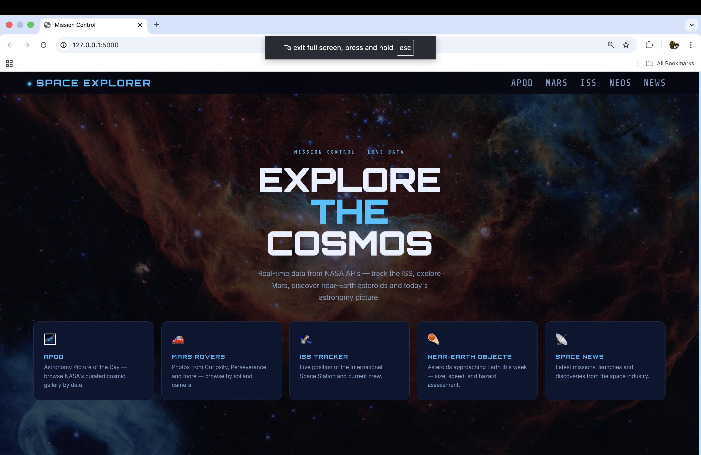
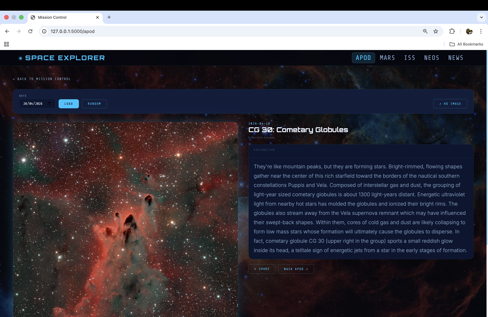
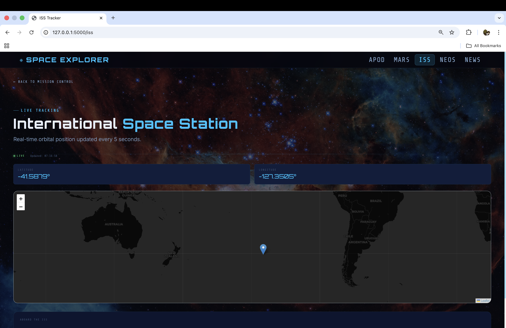
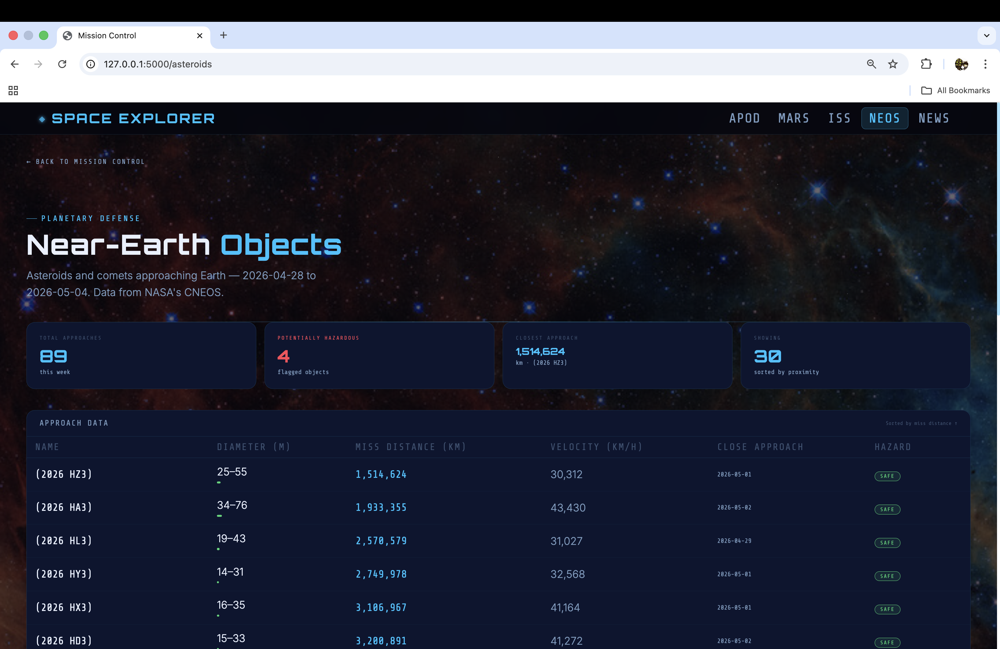

# 🚀 Space Explorer Dashboard



A Flask-based web application that visualizes real-time space data using NASA APIs. Explore the cosmos through live tracking, imagery, and data dashboards.

---

## 🌐 Live Demo

👉 https://your-live-link.com

---

## ✨ Features

* 🌌 **Astronomy Picture of the Day (APOD)**
* 🛰️ **ISS Tracker** with real-time position
* 🔴 **Mars Rover Photos** (Curiosity, Perseverance)
* ☄️ **Near-Earth Asteroids** data
* 📰 **Space News** aggregation

---

## 📸 Screenshots

### 🌌 APOD Page



### 🛰️ ISS Tracker



### ☄️ Asteroids



---

## 🛠️ Tech Stack

* **Backend:** Flask (Python)
* **Frontend:** HTML, CSS
* **APIs:** NASA Open APIs
* **Templating:** Jinja2

---

## ⚙️ Setup

```bash
git clone https://github.com/FermiumParadox/your-repo-name.git
cd your-repo-name
pip install -r requirements.txt
```

Create a `.env` file:

```env
API_KEY=your_nasa_api_key
```

Run the app:

```bash
python app.py
```

---

## 📁 Project Structure

```
day-96-space-explorer-dashboard/
│
├── app.py
├── requirements.txt
├── README.md
├── .env
├── .gitignore
│
├── static/
│   ├── style.css
│   ├── space_bg.jpg
│   └── screenshots/
│       ├── homepage.png
│       ├── APOD_page.png
│       ├── ISS_tracker.png
│       └── asteroids_page.png
│
├── templates/
│   ├── base.html
│   ├── _nav.html
│   ├── index.html
│   ├── apod.html
│   ├── mars.html
│   ├── iss.html
│   ├── asteroids.html
│   └── news.html
│
└── .venv/   (ignored)
```

---

## 📌 Notes

* Make sure your `.env` file is not committed
* Requires a NASA API key

---

## 🙌 Acknowledgements

* NASA Open APIs
* Open-source community

## 👤 Author

**Sijan Thapa**  
GitHub: https://github.com/FermiumParadox